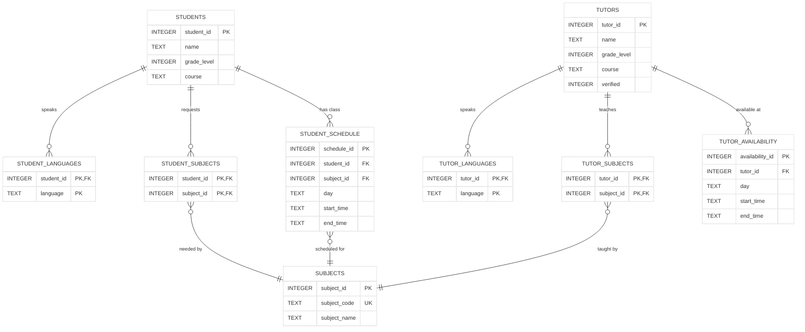

# TUGMA Database Schema

## Entity Relationship Diagram

```mermaid
%%{init: {'theme': 'base', 'themeVariables': { 'primaryColor': '#ffffff', 'mainBkg': '#ffffff', 'background': '#ffffff'}}}%%
erDiagram
    %% Core Parent Entities
    STUDENTS {
        INTEGER student_id PK
        TEXT name
        INTEGER grade_level
        TEXT course
    }

    SUBJECTS {
        INTEGER subject_id PK
        TEXT subject_code UK
        TEXT subject_name
    }

    TUTORS {
        INTEGER tutor_id PK
        TEXT name
        INTEGER grade_level
        TEXT course
        INTEGER verified
    }

    %% Student-Side Tables
    STUDENT_LANGUAGES {
        INTEGER student_id PK, FK
        TEXT language PK
    }

    STUDENT_SUBJECTS {
        INTEGER student_id PK, FK
        INTEGER subject_id PK, FK
    }

    STUDENT_SCHEDULE {
        INTEGER schedule_id PK
        INTEGER student_id FK
        INTEGER subject_id FK
        TEXT day
        TEXT start_time
        TEXT end_time
    }

    %% Tutor-Side Tables
    TUTOR_LANGUAGES {
        INTEGER tutor_id PK, FK
        TEXT language PK
    }

    TUTOR_SUBJECTS {
        INTEGER tutor_id PK, FK
        INTEGER subject_id PK, FK
    }

    TUTOR_AVAILABILITY {
        INTEGER availability_id PK
        INTEGER tutor_id FK
        TEXT day
        TEXT start_time
        TEXT end_time
    }

    %% --- RELATIONSHIPS ---

    %% 1. Pure Student Outer Node
    STUDENTS ||--o{ STUDENT_LANGUAGES : "speaks"

    %% 2. Student-Subject Junctions (Vertical Flow)
    STUDENTS ||--o{ STUDENT_SUBJECTS : "requests"
    STUDENT_SUBJECTS }o--|| SUBJECTS : "needed by"

    %% 3. Student Schedule Mapping (Rerouted through Schedule)
    STUDENTS ||--o{ STUDENT_SCHEDULE : "has class"
    STUDENT_SCHEDULE }o--|| SUBJECTS : "scheduled for"

    %% 4. Tutor-Subject Junctions
    TUTORS ||--o{ TUTOR_SUBJECTS : "teaches"
    TUTOR_SUBJECTS }o--|| SUBJECTS : "taught by"

    %% 5. Pure Tutor Outer Node
    TUTORS ||--o{ TUTOR_LANGUAGES : "speaks"
    TUTORS ||--o{ TUTOR_AVAILABILITY : "available at"
```

## Tables

## Primary Keys

## Foreign Keys

## Relationships

## Normalization